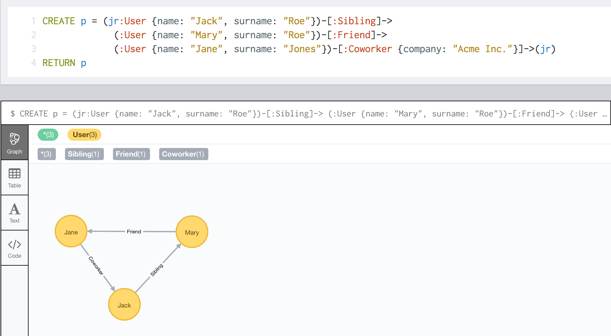

## 操作数据库

### 使用 Neo4j browser

### 创建节点和关系

### 修改现有的数据

### 标签和属性

**多标签**

```
CREATE (u:User:Inactive) RETURN u
```

这样,`u`节点上存在两个标签`User`,`Inactive`

**创建节点的时候同时创建节点的属性**

```
CREATE (u:User {name: "John", surname: "Doe"}) RETURN u
```

**创建多个模式**

这里的**模式** 代表节点, 关系, 路径等想要创建的对象.

```
CREATE (a:User {name: "Jane", surname: "Roe"}),
       (b:User {name: "Carlos", surname: "Garcia"}),
       (c:User {name: "Mei", surname: "Weng"})
```


**创建关系**

```
CREATE (:User {name: "Jack", surname: "Smith"})
          -[:Sibling]->
          (:User {name: "Mary", surname: "Smith"})
```

**创建完整的路径**

一条路径, 包含多个节点以及多个关系. 可以在一条CREATE语句中同时创建, 如下:

```
CREATE p = (jr:User {name: "Jack", surname: "Roe"})-[:Sibling]->
             (:User {name: "Mary", surname: "Roe"})-[:Friend]->
             (:User {name: "Jane", surname: "Jones"})-[:Coworker {company: "Acme Inc."}]->(jr)
RETURN p
```

这样在数据库中就新创建了3个节点, 3个关系, 注意我们使用了变量`jr`作为节点`:User {name: "Jack", surname: "Roe"}`的引用, 返回的消息如下:

> Added 3 labels, created 3 nodes, set 7 properties, created 3 relationships, started streaming 1 records after 12 ms and completed after 12 ms.

**路径可视化**


### 使用读写查询建立已有节点的关系

```
MATCH (a:User {name: "Jack", surname: "Roe"}),
      (b:User {name: "Jack", surname: "Smith"})
   CREATE (a) -[r:Knows]-> (b)
   RETURN a,r,b
```

上面的Cypher语句, 我们建立了用户`a`和用户`b`之间的单向关系, 表示用户`a`了解用户`b`.

### 修改现有的数据

```
MATCH (a:User {name: "Jack", surname: "Roe"}),
      (b:User {name: "Jack", surname: "Smith"})
   OPTIONAL MATCH (a)-[r:Knows]-(b)
   WITH a,r,b
   WHERE r IS NULL
   CREATE (a)-[rn:Knows]->(b)
   RETURN a,rn,b
```

### 创建唯一模式

唯一模式表示, 在CREATE子句中定义的匹配模式必须在数据库中唯一, 否则会抛出错误, 这是一种约束. 一般在业务有这样的要求时使用.

```
MATCH (a:User {name: "Jack", surname: "Roe"}),
      (b:User {name: "Jack", surname: "Smith"})
CREATE UNIQUE (a)-[rn:Knows]->(b) RETURN a,rn,b
```

```
MATCH (a:User {name: "Jack", surname: "Roe"})
CREATE UNIQUE (a)-[rn:Knows]->(b:User {name: "Jack", surname: "Smith"})
RETURN a,rn,b
```

查询用户 `{name: "Jack", surname: "Roe"}`节点, 并绑定到变量`a`, 如果找到, 那么我们创建`a`和`(b:User {name: "Jack", surname: "Smith"})`的关系并返回. 如果没有找到, 那么数据库什么也不会创建. 查询返回 `(no changes, no records)`

如果存在多个 `(a)-[:Knows]-(b)`, 那么数据库抛出异常 `Neo.ClientError.Statement.ConstraintViolation`

### 节点属性的复制

我们通过SET命令把一个节点的所有属性复制到另一个节点.

```
SET y = x
```

社交应用中的别名

```
MATCH (a:User {name: "Jack", surname: "Roe"})
   CREATE (b:Alias)-[:AliasOf]->(a)
   WITH a,b
   SET b = a
RETURN a,b
```

### 给没有标签的节点添加标签

```
MERGE (b:User {name: "Jack", surname: "Smith"})
SET b:Inactive
```

### MERGE

- 支持单节点模式
- 允许用户在当模式匹配时, 模式被创建时要执行的动作

### 使用WITH把查询划分为多个步骤

### REMOVE和DELETE的差异

REMOVE: 用户删除标签和属性.
DELETE: 用户删除节点和关系.

**删除标签**

```
MERGE (b:User {name: "Jack", surname: "Smith"})
REMOVE b:Inactive:MustConfirmEmail
```

**删除属性**

```
MERGE (b:User {name: "Jack", surname: "Smith"})
REMOVE b.age
```

REMOVE 子句是 SET 子句的反向操作. REMOVE 用于删除一个节点上的属性, SET 用户创建或设置节点上的属性. 总之, Neo4j不会存储属性值为NULL的属性, 这种情况下属性不存在.
这体现了Neo4j的Schema Free(NOSQL)的特性

**删除节点和关系**

```
MATCH (c:User {name: "Mei", surname: "Weng"})
DELETE c
```

- 删除是幂等的, 也就是说如果节点不存在, 查询不会失败, 标识没有删除任何东西.
- 属性随节点一起删除, 因此不需要想关系那样需要首先删除关系才能删除节点.
- 如果一个节点存在外向(OUTGOING), 内向(INCOMMING)关系, 那么必须首先删除节点上的关系才能删除节点本身.

**如何删除一个关系**

```
MATCH (:User {name: "Mei", surname: "Weng"})-[r]-() DELETE r
```

如果要同时删除一个节点和它的关系, 我们需要用两条Cypher查询吗, 不总是的, 我们在一条Cypher查询中同时删除节点和节点的关系.

```
MATCH (c:User {name: "Jack", surname: "Smith"})
OPTIONAL MATCH (c)-[r]-()
DELETE r, c
```

**清空数据库**

```
MATCH (a)
  OPTIONAL MATCH (a)-[r]-()
  DELETE a, r
```

也可以添加一个起始点, 以起始节点为准, 删除其实节点相关的所有节点和关系. 这种情况对我们删除一部分数据是很有用的.

```
START a = node(*)
  OPTIONAL MATCH (a)-[r]-()
  DELETE a, r
```

## 循环

Cypher 查询可以分为多个节点, 分别是

- `Read`: 读阶段, 用于从数据库中筛选需要处理的节点和关系
- `Write`: 写节点, 通过读阶段返回的节点和关系集合对齐进行操作(创建, 更新, 删除)
- `Return`: 返回阶段, 把处理后的节点和关系集合返回给调用者, 这个阶段也可以用`WITH`来代替, 表示把原先RETURN的结果传递给下一次Cypher查询.

通过`WITH`, 我们可以像管道一样把多个Cypher查询串联起来, 一个Cypher查询的输出可以作为另一个Cypher查询的输入.

读阶段是非常重要的, 因为对于读阶段返回的所有节点, 在写阶段会循环处理读阶段返回的每一个节点和关系. 比如下面的查询:

```
MATCH (a:User {surname: "Roe"})
   SET a.place = "London"
   RETURN a
```

`SET`语句会把所有 `surname` 属性为 `Roe` 的User节点的`place`属性设置为`London`. 因此在执行单节点更新的时候需要进行限定, 我们可以在创建节点的时候给定一个类似UUID这种能够全局唯一确定节点ID的熟悉.

> 注意Neo4j的内部ID不能作为业务主键, 因为它会重用删除的节点ID.


## 处理集合

唯一需要迭代处理的就是集合了. Cypher 可以不同类型的集合, 比如节点集合, 关系集合, 以及属性.因此可能需要对集合进行迭代以执行某些写操作.
Cypher 提供了一个`FOREACH`子句来完成集合的迭代操作. 它的语法形式如下:

```
FOREACH (variable IN collection | command)
```

上述行可以解释为, 对于集合`collection`中的每一个元素`variable`, 传递给(|) `command`进行处理.

例子:

```
MATCH p=shortestPath(
  (a:User {name: "Mary", surname: "Smith"})-[*]-(b:User {name: "Jane", surname: "Jones"})
)
FOREACH (n IN tail(nodes(p)) |
  CREATE UNIQUE (n)-[:MaybeKnows]->(a)
)
```
